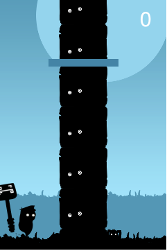
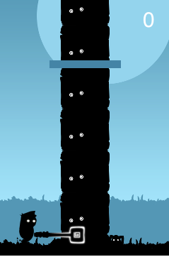

# Timber Man game in Racket

## Leangseu Kim
### April 26, 2017

# Overview
This is a game that was written in Racket. This game similiar to mobile game. It response to the keybord left and right. The most important feature is store high score on online database.

The code would recursively retrieve database from and print out the top score. If there is more than 10 people, it will print only 10.

The game client is inside ```Timberman.rkt``` file. Just open it with racket and then run it. It will prompt for the name. The game support keyboard and mouse input.

KEYS:
```left``` move or stay left
```right``` move or stay right
```space``` start the game

MOUSE:
On game over screen you will be able to click on the Replay and High Score button.

# Libraries Used
The code uses four libraries:

```racket
(require gui/base)
(require db)
(require 2htdp/images)
(require 2htdp/universe)
```

* For this specific project, ```gui/base``` library provide sound. We did not use rsound because it seem to be slow down the game.
* The ```db``` library is used to connect to online high score [heroku](https://rocky-meadow-57997.herokuapp.com/).
* The ```2htdp/images``` library is draw and place images.
* The ```2htdp/universe``` library is used to create windows and accepting input like keyboard and mouse click.

# Key Code Excerpts

## 1. Using online database

The following code is use to connect to postgres on [heroku](https://www.heroku.com/). It only support [postgreSQL](https://www.postgresql.org/) for free tier.

```racket
(define data
  (postgresql-connect
   #:user "cjtvjnbaczmcyu"
   #:database "d1hioc7tekfh41"
   #:server "ec2-23-23-223-2.compute-1.amazonaws.com"
   #:ssl 'yes
   #:password "858a41f4062992060150c844020f8f0b4d98f8bf8c54405896d7fbef858b6f0f"))
```

There are instruction how to get these data. You can find it [here](https://devcenter.heroku.com/articles/heroku-postgresql). This is a public project. You should not post all of these data online. It would allow anyone to access your database.

Once you connect with database, you can do anything all the thing with it. Most use would be:

```racket
(query-exec <name data connected> "sql command")
```

SQL is an easy language to learn. Here is the [link](http://www.petefreitag.com/cheatsheets/postgresql/) to learn a few simple postgreSQL command.

## 2. Using Lambda

The following code would take a list. It remove the first element and add 1 random number the end of the list.

```racket
;; Take a list, push the first number out then add 1 number to the end
;; the logic is the tree can't have the same side twice. Like 3 4 or 4 3
(define (enqueue lst)
  ((lambda (x)
     ;; get the last element of the list
     (cond ((and (= right-branch (caddr (cdddr lst))) (= left-branch x)) (enqueue lst))
           ((and (= left-branch (caddr (cdddr lst))) (= right-branch x)) (enqueue lst))
           ;; make sure the isn't more than 2 of the same trunk generate
           ((and (> 3 (cadr (cdddr lst))) (> 3 (caddr (cdddr lst))) (> 3 x)) (enqueue lst))
           ((= x (cadr (cdddr lst)) (caddr (cdddr lst))) (enqueue lst))
           (else (append (remove (car lst) lst) (cons x '())))))
   (random 5)))
```

Since we represent our tree as a list. It's convenient to check the state of collision and drawing as well. The approch is to make list of tree to draw. We had 5 different tree parts and put it on a list. Each branch types would represent with number 0-4. This specific procedure is use to cut down the tree. Instead of having a long list of tree, we would just remove the bottom tree then add a new tree branch to the top of the tree.

```(caddr (cdddr lst))``` would get the last element of the list. We had 6 elements on the list when the game start. ```(define init-playing (make-playing 50 0 character-pos-left '(0 1 2 3 0 4)))``` Number 3 and 4 would be representing right and left branch. 0, 1 and 2 are the part without branch.

This would also help when we check the collision with the player. If the player on the left side and the first element of the tree list is 4; or likewise for right side, the player lost and game over.

```racket
;; Game logic where character die return true
(define (character-die position state)
  (cond ((and (= (car (playing-tree state)) 4)
              (= position character-pos-left)) #t)
        ((and (= (car (playing-tree state)) 3)
              (= position character-pos-right)) #t)
        ((= (playing-time state) 0) #t)
        (else #f)))
```

## 3. Using Map and Lambda

The following is use to create high score list.

```racket
;; return list format ((name score) ....)
(define (get-database-list)
  (map (lambda (x y) (list x y))
   (query-list data "select name from hs order by score desc")
   (query-list data "select score from hs order by score desc")))
```

It retrieves name and score from database in descending order. Then it create a list in formatted manner that would be easy for me to extract and intergrate it into GUI.

## 4. Using Tail Recursion

There multiple tail recursion in this project. We were just tried to make it as efficient as possible since it is a fast pace game.

```racket
;;draw the top high score
(define (draw-highscore state)
  (define (draw-current-score score image)
    (place-image (text (~a username " : " score) 60 "white")
                 (/ WIDTH 2)
                 60
                 image))
  (define (draw-iter lst n image)
    (if (> n 0)
        (place-image (text (caar lst) 50 "white")
                     (+ (/ (image-width (text (caar lst) 50 "white")) 2) 25)
                     (- HEIGHT (* n 60))
                     (place-image (text (number->string (cadar lst)) 50 "white")
                                  (- WIDTH (/ (image-width (text (number->string (cadar lst)) 25 "white")) 2) 25)
                                  (- HEIGHT (* n 60))
                                  (draw-iter (cdr lst) (- n 1) image)))
        image))
  (define a (get-database-list))
  (define b (draw-current-score (number->string (highscore-current-score state)) background))
  ;; if the the table is greater than 10, only draw top 10 of them
  (if (> (length a) 10)
      (draw-iter a 10 b)
      (draw-iter a (length a) b)))
```

This code is a bit long but I was just trying to catch all the possible errors. ```draw-current-score``` is simply display current player's score. ```~a``` is probably the easiest way to concatinate string in Racket. There are more of its syntax. [Link](https://docs.racket-lang.org/reference/strings.html#%28def._%28%28lib._racket%2Fformat..rkt%29._~7ea%29%29).

```draw-iter``` is the tail recusion of drawing high score. It would retrieve the list formatted ```((name score) (...) ...)``` from database then draw the top score. The database row could be larger than 10 and it would not fit into the screen which is why I catch it with ```(> (length a) 10)```.

## 5. Object Oriented programming

```racket
(define-struct game-start () #:transparent)
(define-struct playing (time score position tree) #:transparent)
(define-struct game-over (score position tree sound) #:transparent)
(define-struct highscore (current-score) #:transparent)
(define-struct chopping (time score position tree sound) #:transparent)
```

These are the presentation of the world state for drawing ```big-bang```. I specifically create chopping state to create the chopping animation. 

```racket
(define (key/playing state key)
  (cond
    ((key=? key "left")
     (update-playing-position character-pos-left state))
    ((key=? key "right")
     (update-playing-position character-pos-right state))
    ;;((key=? key "up") (update-playing-tree (playing-tree state) state))
    (else (make-playing (playing-time state) (playing-score state) (playing-position state) (playing-tree state)))))
```

When the button is press it would call ```update-playing-position```. 

```racket
(define (update-playing-position position state)
  (define (add-time time)
    (if (> (+ time 4) 100)
        100
        (+ time 4)))
  (if (character-die position state)
      (make-game-over (playing-score state) position (playing-tree state) (sound-gameover))        
      (make-chopping (add-time (playing-time state))
                      (+ (playing-score state) 1)
                      position
                      (enqueue (playing-tree state))
                      (sound-chopping))))
```

```update-playing-position``` return chopping world state, which draw the character chopping tree instead of holding the axe up.





```racket
;;draw chopping
(define (draw-chopping state)
  (draw-chopping-man
   (chopping-position state)
   (draw-score
    (chopping-score state)
    (draw-time-bar (chopping-time state)
                   (draw-tree-trunk (chopping-tree state) (draw-ground))))))
				   
(define (draw-chopping-man position image)
  (define character
    (if (= position character-pos-right)
        timber-man-att-right
        timber-man-att-left))
  (place-image character
               (* position WIDTH)
               (- HEIGHT (image-height ground))
               image))
```

In order to return to normal I used on-tick event handle to update the animation back to normal. In this case it return to playing world state.

```racket
(define (tick-event/chopping state)
  (back-to-playing state))
```

This whole code is just to create chopping animation.

