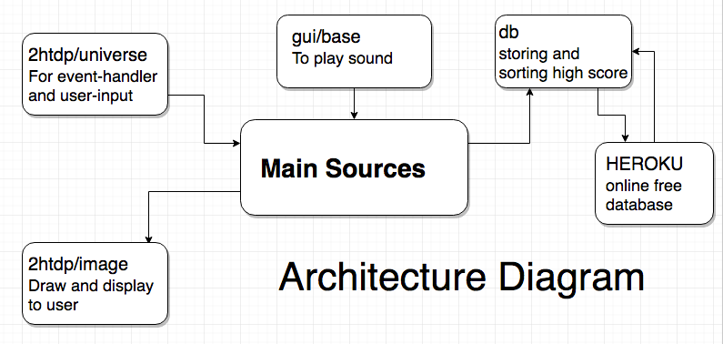
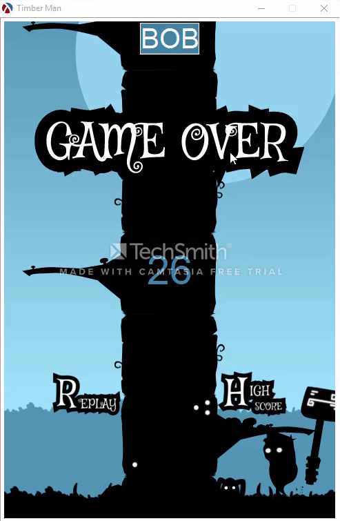

# Timberman

### Statement

For this project, we wanted to make something that relates to us personally by making a game.  The project is intented for learning new thing such as creating a game that we both really like because we both have been playing video game as young as we can remember. We hope to learn how we can apply the topics we learned in class into something that we can create for later uses and gain experience using with GitHub for a team project.

### Analysis

2htdp/image: we have use for displaying Images/Sprites
2htdp/universe: we have use for communication between the user and program
Rsound: we have used rsound to assist with sounds proccessing

- Will you use data abstraction?
we have used a list containing objects to calucate the sprite postion and check for collusion.
- Will you use recursion?
We have used recursion to get the random number to generate branches for collusion and as well as input from the player's such as the arrow keys. By using tail recursion on the drawing, it helps the tree improve the efficiency for generating branches.  
- Will you use map/filter/reduce? How?
We have used map for dealing with list.

Lambda enqueue it would generate the wrong number without lambda function.
Collision check for sprites and branch at the same side. The tree is a list of left right and none while sprites can only position left and right. If they are at the same side and the same time, game over. 

### External Technologies

- process sound
We have used gui/base to add audio effect/effects unit and a music along when responsing to the user input.
- retrieve information/publish data to the web
We have created a high score list that stores the user scores into a databse and display it back to the user. We also have publish the data (highscore) to a website using [heroku](https://rocky-meadow-57997.herokuapp.com/).

### Data Sets or other Source Materials

N/A

### Deliverable and Demonstration

For demonstration day, we have a complete game that is very similar to the orginal game. At the live demo people will be able to test out our game and as well as sounds, music, and highscore will be able to be display in the final demonstration.

### Evaluation of Results

we have completed the movement control, added music/sounds, get the highscore system working, and the collusion function to work. we have successful finish our goals for the project.

## Architecture Diagram



## Schedule

### First Milestone (Sun Apr 9)

Make basic gui and it work with keyboard.
I seperate the game into 3 states: game-start, playing, game-over.

##### game-start state

```racket
(define (draw state)
  (cond
    [(game-start? state) (scale SCALE (draw-game-start state))]
    [(playing? state) (scale SCALE (draw-playing state))]
    [(game-over? state) (scale SCALE (draw-game-over state))]
    [else (error 'unknown)]))

(define (draw-game-start state)
  (place-image text-title
               (/ WIDTH 2) (* 1/4 HEIGHT)
               background))

(big-bang (make-game-start)
         [on-draw draw]
         [on-key key-event]
         [on-tick tick-event])
```

big-bang would create a world state. It this case, it would call make-game-start states. Then draw get call and check which state to draw.

I also implemented key-event that would take input.

```racket
(define (key/game-start state key)
  ; when the game in game-start mode
  ; the game will start with any key
  init-playing)

;; when timber man is at the left 1/6 and right 5/6
;;start time is 100
(define init-playing (make-playing 100 0 1/6))
```

when any key press during game-start state, init-playing will be call and the world will go into playing state.

##### playing state

Most of the drawing and key-event are similar to game-start state. The only different is I implement tick-event which would help updating the game progress.

```racket
(define (update-playing-time time state)
  (cond ((= time 0) (make-game-over))
        (else (make-playing (- time time-decay) (playing-score state) (playing-position state)))))

(define (tick-event state)
  (if (playing? state)
      (tick-event/playing state)
      state))

(define (tick-event/playing state)
  (update-playing-time (playing-time state) state))
```

update-playing-time would decrease the time-bar. When it hit 0, game-over state got call.

There should be extra implement the maximum time player can get and how player can earn more time to infinitely challenge the game. Since I consider those are game logic, we have implemented it on next Milestone.

##### game-over state


This state has similar implementation to game-start, however, there are more work to be done. It needs to display current score and compare high score as well.

##### image


**plan for the next Milestone is to implement game logic and sounds.**

Most of the assets that were use in this project are from this [site](http://www.emanueleferonato.com/2015/02/16/create-an-html5-game-like-timberman-in-a-matter-of-minutes-with-mightyeditor/).

Some of those are made using [gimp](https://www.gimp.org/).

Creating gif [mov to gif](https://cloudconvert.com/mov-to-gif).

### Second Milestone (Sun Apr 16)
For our second milestone we have accomplished the following functions so far draw trunk, high score, generation for tree algorithm, collision, database, sound, and mouse response. But some of them have not been integrated completely yet, we have finished them.


The function below handles the collusion functions for our game. It checkes if the charactor have die or not. if it have then it will mark that the game is over and update the score, bonus time, and enqueue tree. 

```racket
(define (update-game state)
  (if (character-die (playing-position state) state)
      (make-game-over (playing-score state) (playing-position state) (playing-tree state))
      (make-playing (- (playing-time state) 1)
                    (playing-score state)
                    (playing-position state)
                    (playing-tree state))))
```

We also have added mouse event in our second milestone where it check if the game state is in game-over or not, if it is then it will check if the user have pressed a button which there is only one button right now (restart, but we are planning to add more). Then, it will restart the game to a new state and restart the game once again.

```racket
(define (mouse-event state x y mouse)
  (if (game-over? state)
      (mouse-event/game-over state x y mouse)
      state))

(define (mouse-event/game-over state x y mouse)
  (cond
    ((and (mouse=? mouse "button-down")
          (< (* (- (* 1/4 WIDTH) play-again-height) SCALE) x) (< (* (- (* 3/4 HEIGHT) play-again-height) SCALE) y)
          (> (* (+ (* 1/4 WIDTH) play-again-height) SCALE) x) (> (* (+ (* 3/4 HEIGHT) play-again-height) SCALE) y))
     init-playing)
    (else (game-over (game-over-score state) (game-over-position state) (game-over-tree state)))))
```
Below shows what we have got working so far in this project comapare to the first milestone.


Our plans for the next Milestone is to implement a better design for the sprite/envirnment, sounds integrated, high score list database, and some other functions as we see fit.

Sound/Music was taken from [orangefreesounds](http://www.orangefreesounds.com/).

### Public Presentation (Mon Apr 24, Wed Apr 26, or Fri Apr 28 [Mon Apr 24 at Olsen Hall 3rd floor 12n–1250p])

Demo Report

We have successful finished this project. We have finished all but one of milestone which was a better design for the sprite/envirnment. Beside that we have completed all of our plans for this project. We have accomplished the second milestone successfully. we have finished adding the sounds integration and high score list database. 




As for the highscore, we used postgresql and connect it [heroku](https://rocky-meadow-57997.herokuapp.com/) free server.
```racket
(define (update-table name score)
  (when (equal? name "") (set! name "NO NAME"))
  ;; only update when the score get higher
  ;; if name doesn't exist it return false else will also return score
  (define old-score
    (query-maybe-value data (~a "select score from hs where name = '" name "'")))
  (cond ((false? old-score) (query-exec data (~a "insert into hs values('" name "', " score ")")))
        ((> score old-score) (query-exec data (~a "update hs set score = " score "where name = '" name "'")))))
        
        ;; display score from highest to lowest
(define (display-score)
  (for ([(name score) (in-query data "select * from hs order by score desc")]) (printf "~a\t: ~a\n" name score)))
```
Open _timberma.rkt_ with **DrRacket** and press run.
Users will be prompted for a name when the game starts. This name will be store in high score database. The score will only update if the user get higher score. Otherwise it will only hold the old high score record. The score is stored on [heroku](https://rocky-meadow-57997.herokuapp.com/). So everyone that play the game will have the same high score board. Sound and chopping animation is also added.

we have the game working properly with all the functions and sounds we have planned.
### Chhayhout Chhoeu @slenderize
will work on processing sound and database.
### Leangseu Kim @leangseu
will work on gui and client.
### Group work
keyboard input/movement.
