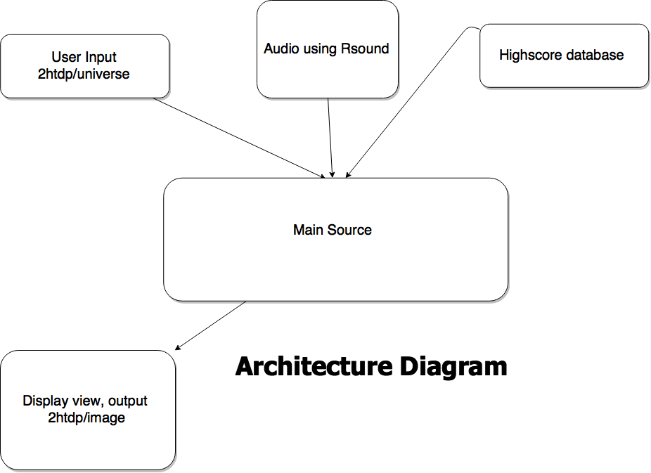
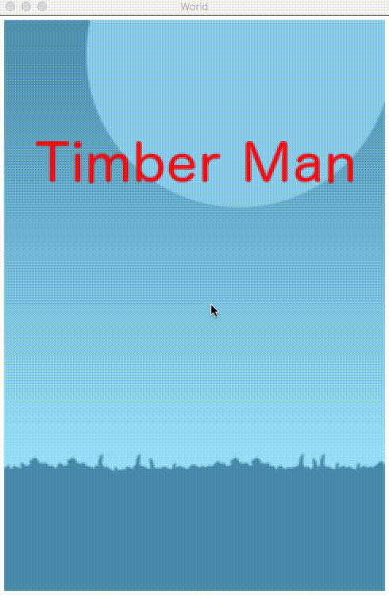

# Timberman

### Statement

For this project, we wanted to make something that relates to us personally by making a game.  The project is intented for learning new thing such as creating a game that we both really like because we both have been playing video game as young as we can remember. We hope to learn how we can apply the topics we learned in class into something that we can create for later uses and gain experience using with GitHub for a team project.

### Analysis

2htdp/image: Will be use for displaying Images/Sprites
2htdp/universe: Will be use for communication between the user and program
Rsound: Assist with sounds proccessing

- Will you use data abstraction?
We will be using a list containing objects to calucate the sprite postion and check for collusion.
- Will you use recursion?
We plan on using recursion to get the random number to generate branches for collusion and as well as input from the player's such as the arrow keys.
- Will you use map/filter/reduce? How?
We plan on using map for dealing with list.

Collision check for sprites and branch at the same side. The tree is a list of left right and none while sprites can only position left and right. If they are at the same side and the same time, game over.

### External Technologies

- process sound
We will be using Rsound to add audio effect/effects unit and a music along when responsing to the user input.
- retrieve information
We might also plan on creating a high score list that stores the user scores into a databse and display it back to the user.

### Data Sets or other Source Materials

N/A

### Deliverable and Demonstration

For demonstration day, we are planning to have a complete game that is very similar to the orginal game. At the live demo people will be able to test out our game and as well as sounds, music, and highscore will be able to be display in the final demonstration.

### Evaluation of Results

If we can complete the movement control, add music/sounds, get the highscore system working, and the collusion function to work then we have successful finish our goals for the project.

## Architecture Diagram



## Schedule

### First Milestone (Sun Apr 9)

Make basic gui and it work with keyboard.
I seperate the game into 3 states: game-start, playing, game-over.

##### game-start state

```racket
(define (draw state)
  (cond
    [(game-start? state) (scale SCALE (draw-game-start state))]
    [(playing? state) (scale SCALE (draw-playing state))]
    [(game-over? state) (scale SCALE (draw-game-over state))]
    [else (error 'unknown)]))

(define (draw-game-start state)
  (place-image text-title
               (/ WIDTH 2) (* 1/4 HEIGHT)
               background))

(big-bang (make-game-start)
         [on-draw draw]
         [on-key key-event]
         [on-tick tick-event])
```

big-bang would create a world state. It this case, it would call make-game-start states. Then draw get call and check which state to draw.

I also implement key-event that would take input.

```racket
(define (key/game-start state key)
  ; when the game in game-start mode
  ; the game will start with any key
  init-playing)

;; when timber man is at the left 1/6 and right 5/6
;;start time is 100
(define init-playing (make-playing 100 0 1/6))
```

when any key press during game-start state, init-playing will be call and the world will go into playing state.

##### playing state

Most of the drawing and key-event are similar to game-start state. The only different is I implement tick-event which would help updating the game progress.

```racket
(define (update-playing-time time state)
  (cond ((= time 0) (make-game-over))
        (else (make-playing (- time time-decay) (playing-score state) (playing-position state)))))

(define (tick-event state)
  (if (playing? state)
      (tick-event/playing state)
      state))

(define (tick-event/playing state)
  (update-playing-time (playing-time state) state))
```

update-playing-time would decrease the time-bar. When it hit 0, game-over state got call.

There should be extra implement the maximum time player can get and how player can earn more time to infinitely challenge the game. Since I consider those are game logic, I will implement it on next Milestone.

##### game-over state

This state has similar implementation to game-start, however, there are more work to be done. It needs to display current score and compare high score as well.

##### image



**plan for the next Milestone is to implement game logic and sounds.**

Most of the assets that were use in this project are from this [site](http://www.emanueleferonato.com/2015/02/16/create-an-html5-game-like-timberman-in-a-matter-of-minutes-with-mightyeditor/).

Some of those are made using [gimp](https://www.gimp.org/).

Creating gif [mov to gif](https://cloudconvert.com/mov-to-gif).

### Second Milestone (Sun Apr 16)

GUI, algorithm for collusion, and high score list display.

Sound/Music was taken from orangefreesounds (http://www.orangefreesounds.com/).
### Public Presentation (Mon Apr 24, Wed Apr 26, or Fri Apr 28 [your date to be determined later])

Having the game work properly with all the functions and sounds we have planned.

### Chhayhout Chhoeu @slenderize
will work on processing sound and keyboard input/movement for this project.

### Leangseu Kim @leangseu
will work on gui and client.
